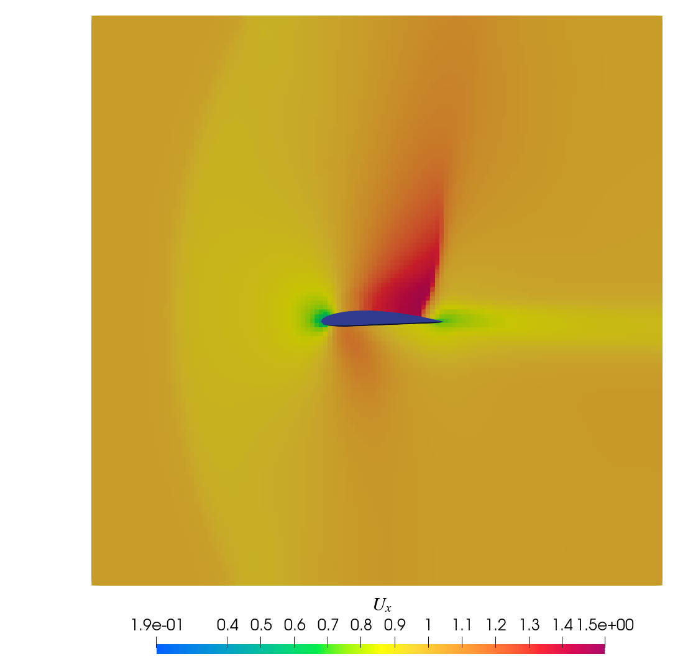

# ebamr
# !! WARNING !!
ebamr development is currently stalled in favor of its GPU version ebamr-GPU
---
Using Embedded Boundary Method and AMR to solve discreted equations.
- Based on AMReX to implement AMR (adaptive mesh refinement)
- FVM using high order scheme (5th order TENO)
- GPU support and higher order EB method are WIP.

